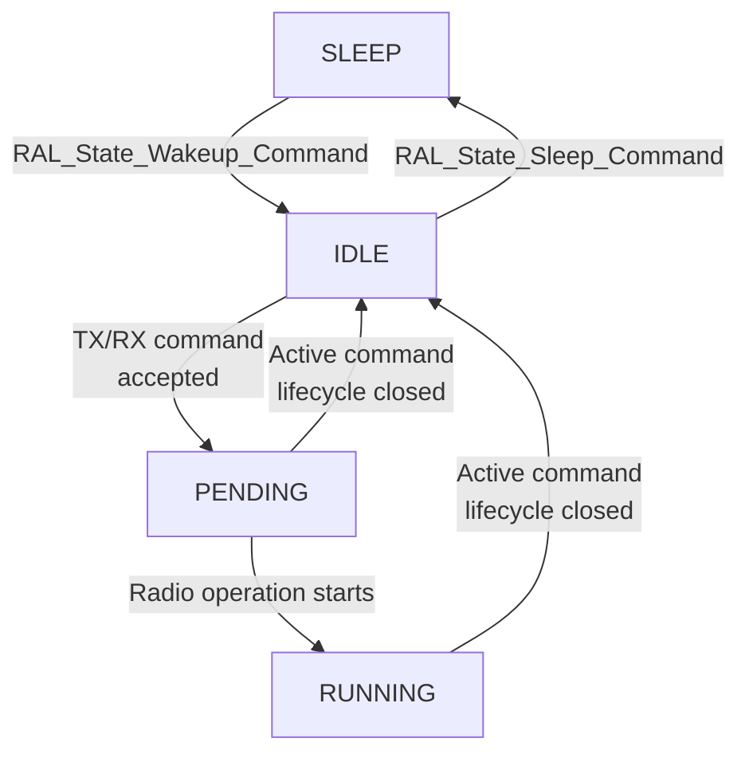
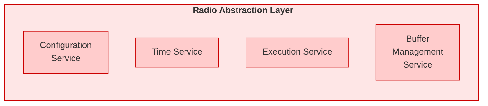

# Overview

This section describes the main features of the Radio Abstraction Layer (RAL), how commands transition the RAL between states, and how the RAL manages radio operations and the lifecycle of commands.

The operational model described here underpins the normative behavior specified in RAL Services, explaining the terminology used in command descriptions.

## RAL States

The RAL operates in one of four states:

| State | Description |
|-------|-------------|
| `SLEEP` | Initial RAL state. Some commands cannot be accepted or executed, notably including commands that schedule receptions and transmissions. |
| `IDLE` | The RAL is ready to execute scheduling commands, but no radio operation is scheduled or ongoing. |
| `PENDING` | The RAL is tracking a pending radio operation that will run in the future. |
| `RUNNING` | A radio operation is actively in progress (including ramp-up time, transmission or reception, and ramp-down time). |

<!--TODO: Add note on why it is important to distinguish between PENDING and RUNNING; if it is not important, we can merge them into a state ACTIVE-->

## Active Command

When the RAL accepts a command that schedules a transmission or a reception, that command becomes the "active command", and the RAL transitions to the `PENDING` state. The RAL tracks the active command and its associated parameters internally until the command lifecycle concludes, at which point the RAL returns to its `IDLE` state and is ready to accept a new prospective active command.
A RAL in `PENDING` or `RUNNING` state always tracks an active command.

At most one active command exists at any time. A new command that schedules a transmission or a reception can only be accepted when no active command exists and the RAL is in `IDLE` state.

## State Transitions

The following diagram shows the RAL state transitions. Every transition is driven by a command, a radio event, or an error condition.

| From | To | Trigger | Description |
|------|----|---------|-------------|
| `SLEEP` | `IDLE` | `RAL_State_Wakeup_Command` | The RAL ensures the radio is operational and ready to accept commands that schedule transmissions or receptions. |
| `IDLE` | `SLEEP` | `RAL_State_Sleep_Command` | The RAL may cause the radio hardware to enter a power-saving mode. |
| `IDLE` | `PENDING` | Accepted `RAL_Tx_Schedule_Command` `RAL_Rx_Schedule_Command` | The RAL accepts a triggering command, which becomes the active command. The RAL transitions to `PENDING` and prepares the radio for the scheduled operation. |
| `PENDING` | `RUNNING` | The radio operation associated to the active starts | The scheduled point in time is reached and the radio begins transmitting or receiving. |
| `PENDING` | `IDLE` | Active command lifecycle closed | The scheduled operation is concluded before it starts on air, due to an error condition or a cancellation request. The RAL emits the corresponding terminal event, closing the command lifecycle. Refer to the command description for the normative behavior. |
| `RUNNING` | `IDLE` | Active command lifecycle closed | The radio operation concludes on air, whether successfully, due to an error condition, or due to a cancellation request. The RAL emits the corresponding terminal event, closing the command lifecycle. Refer to the command description for the normative behavior. |

## Command Cancellation

The active command may be cancelled at the request of the upper layer.

In the normative behavior of command descriptions, the terms "cancel" and "abort" describe distinct aspects of terminating an activity:

- "Cancel" applies to the active command. An upper layer issues `RAL_Cancel_Command` to request cancellation of the active command.
- "Abort" applies to the radio operation itself. When the active command is cancelled, the RAL aborts the scheduled or ongoing radio operation. However, the RAL may also abort radio operations autonomously due to error conditions. 

## Radio Time

The RAL maintains an internal tick counter incrementing at a frequency `RAL_TICK_FREQ_HZ`. All RAL timestamps are derived from this counter. The counter is a non-negative integer of `RAL_TICK_COUNTER_WIDTH` bits (RAL-specific, constant per RAL instance), wrapping around to `0` after reaching `2^RAL_TICK_COUNTER_WIDTH - 1`. It is monotonically non-decreasing except upon wraparound, and as long as the RAL remains in a state other than `SLEEP`.

<!--CHECK: RAL_TICK_COUNTER_WIDTH and RAL_TICK_FREQ_HZ may be turned into Configuration Service attributes, letting CORE configure the radio based on them.-->

### `RalInstant`

`RalInstant` is a parameter type used for RAL timestamps. It is an Unsigned Integer of width greater or equal `RAL_TICK_COUNTER_WIDTH` bits, whose valid range is `0` to `2^RAL_TICK_COUNTER_WIDTH - 1`.

Since all RAL timestamps are based on the internal tick counter, `RalInstant` values may be affected by wraparound.
Consider two valid `RalInstant` values `t_1` and `t_2`, where `t_2` refers to a point in time in the future w.r.t. `t_1`. `t_2` may be lower than `t_1` due to wraparound. The upper layer is responsible for handling wraparound. The `RAL_Time_Instant_Diff_Command` provides wraparound-safe difference computation.

### `RalInstantDiff`

`RalInstantDiff` is a parameter type used for time intervals between RAL timestamps. It is a (signed) Integer of width greater or equal `RAL_TICK_COUNTER_WIDTH` bits, whose valid range is `-2^(RAL_TICK_COUNTER_WIDTH - 1)` to `2^(RAL_TICK_COUNTER_WIDTH - 1) - 1`.

## `PacketBuffer`

The RAL defines the `PacketBuffer` abstraction to represent the memory space used for transmitting or receiving the PSDU of a single transmission unit.

Each `PacketBuffer` is characterized by the following parameters:

| Name | Type| Valid Range| Description |
|------|-----| -----------|------------------------------------------|
| `buffer_type`               | Enumeration      | `BUFFER_TYPE_GENERAL_PURPOSE`, `BUFFER_TYPE_TIGHTLY_COUPLED`  | Specifies the type of the buffer, as defined in [§Buffer Specializations](#buffer-specializations).                                                      |
| `buffer_data`               | Octet Buffer     | — | Octet region in memory used for the buffer's data, including the PSDU, as well as headroom and tailroom reserved for the RAL.                            |
| `buffer_size`               | Unsigned Integer | — | Size of `buffer_data`, i.e., the number of octets the buffer is able to store.|
| `psdu`                      | Octet Buffer | — | Reference to the PSDU within `buffer_data`.|
| `psdu_length`               | `PSDULength`     | as defined in [§PSDULength](#psdulength) | Length of the PSDU, excluding the MIC. |
| `psdu_region_unsecured`         | Octet Buffer | — | Reference to the octet region `BUFFER_REGION_UNSECURED` within the PSDU. Defined only if a non-zero size for the region has been declared through [§RAL_Buffer_Configure_Regions_Command](./ral-buffer-manager-service.md#ral_buffer_configure_regions_command).|
| `psdu_region_unsecured_size`         | Unsigned Integer | — | Size of the PSDU octet region `BUFFER_REGION_UNSECURED`.|
| `psdu_region_authenticated` | Octet Buffer | — |  Reference to the octet region `BUFFER_REGION_AUTHENTICATED` within the PSDU. Defined only if a non-zero size for the region has been declared through [§RAL_Buffer_Configure_Regions_Command](./ral-buffer-manager-service.md#ral_buffer_configure_regions_command). |
| `psdu_region_authenticated_size`         | Unsigned Integer | — | Size of the PSDU octet region `BUFFER_REGION_AUTHENTICATED`.|
| `psdu_region_encrypted`     | Octet Buffer | — | Reference to the octet region `BUFFER_REGION_ENCRYPTED` within the PSDU. Defined only if a non-zero size for the region has been declared through [§RAL_Buffer_Configure_Regions_Command](./ral-buffer-manager-service.md#ral_buffer_configure_regions_command).  |
| `psdu_region_encrypted_size`         | Unsigned Integer | — | Size of the PSDU octet region `BUFFER_REGION_ENCRYPTED`.|

The [Buffer Manager Document](./ral-buffer-manager-service.md) details the rules governing the lifecycle and behavior of `PacketBuffers`.

### `PSDULength`

<!-- CHECK: Why is this not a config attribute?-->
`PSDULength` is an unsigned integer limited by the PHY-specific maximal PSDU length: `PHY_MAX_PSDU_LENGTH`.

`psdu_length` includes the FCS, where present, and excludes the MIC. In length expressions, `F` is [§fcsLength](./ral-config-service.md#generic-configuration-attributes), the number of FCS octets the PSDU carries. The three regions cover `psdu_length - F` octets; the FCS requires no caller commit. Restoration applies only to these regions. The complete on-air PSDU length is `psdu_length + M`, where `M` is the current `micSize` for a protected partition and zero otherwise. This length MUST NOT exceed `PHY_MAX_PSDU_LENGTH`.

### Buffer Specializations

The RAL distinguishes the following `PacketBuffer` specializations: 

|Name|Abbreviation|`buffer_type` enum value |Description|
|-|-|-|-|
`GeneralPurposePacketBuffer`|GPPB|`BUFFER_TYPE_GENERAL_PURPOSE`| Buffer that is represented in RAM and encoded with the `buffer_type` enum value. Its data can be accessed directly through the `buffer_data` parameter. The support for GPPB is mandatory for all RAL implementations.|
`TightlyCoupledPacketBuffer`|TCPB|`BUFFER_TYPE_TIGHTLY_COUPLED`|Represents a buffer located close to the radio hardware, for which the associated `buffer_data` serves as a staging region (or "shadow buffer"). A TCPB can be implemented in a RAL-specific way, potentially enabling performance benefits for selected platforms. The support for TCPBs is optional for all RAL implementations.|

Detailed descriptions of buffer specializations are located in the [Buffer Manager](./ral-buffer-manager-service.md#packet-buffer-specializations) document.

## RAL Services

<!-- Figure [RAL Services Diagram](#fig-ral-services-diagram) depicts the services provided by the RAL.   -->

Table [RAL Services](#table-ral-specification-contents) summarizes each service. Each service has a dedicated section where all its primitives (commands and events) are presented.

<!-- 

 

**Figure**: RAL Services Diagram.

  -->

**Table**: Specification Contents. 

| Component                                        | Description                                                                                           | Version  |
| ------------------------------------------------ | ----------------------------------------------------------------------------------------------------- | -------- |
| [Execution Service](./ral-execution-service.md)                | Schedule radio operations, providing the functionalities necessary to meet real-time constraints. | 0.0.1    |
| [Time Service](./ral-time-service.md)        | Access the current radio timestamp and perform basic transformations on it.                   | 0.0.1    |
| [Configuration Service](./ral-config-service.md) | Read and modify the radio configuration.                                            | 0.0.1    |
| [Buffer Manager Service](./ral-buffer-manager-service.md)                      | Manage and use packet buffers.                                                         | 0.0.1 |
| [Security Service](./ral-security-service.md) | Install and remove the key, and draw the IV seed. | 0.0.1 |

